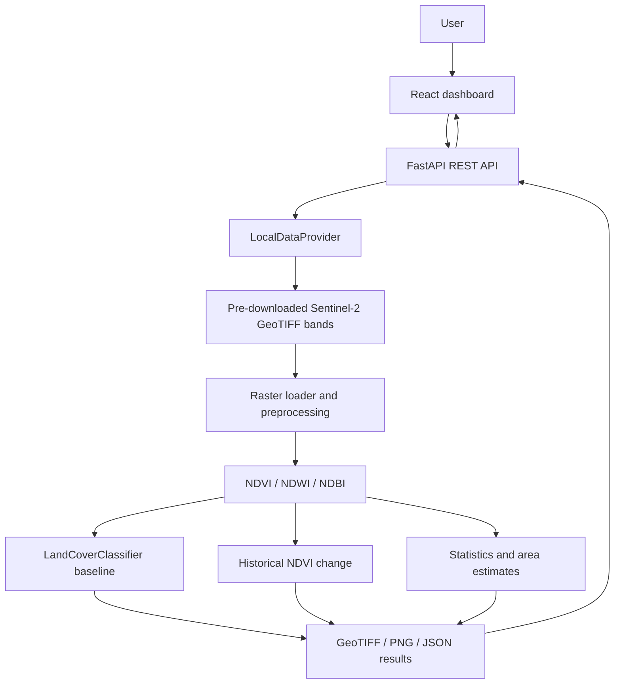

# Architecture

The processing modules depend on raster arrays and metadata, not on FastAPI or the browser. `SatelliteDataProvider` is the source boundary; Stage A implements `LocalDataProvider`. Stage B can add another implementation for retrieved imagery after retrieval and alignment validation, without rewriting the index or classification logic.

The Leaflet map receives backend-rendered PNG overlays and WGS84 bounds calculated from source transforms. OpenStreetMap tiles are an optional online basemap, not an imagery input.
