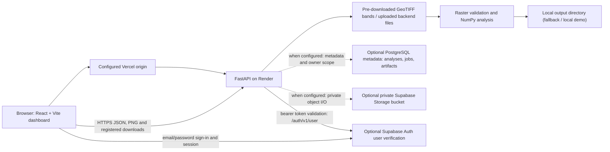
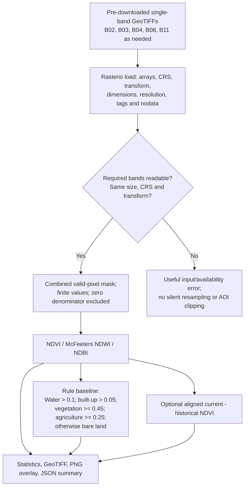
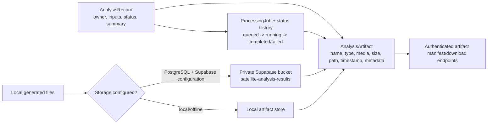
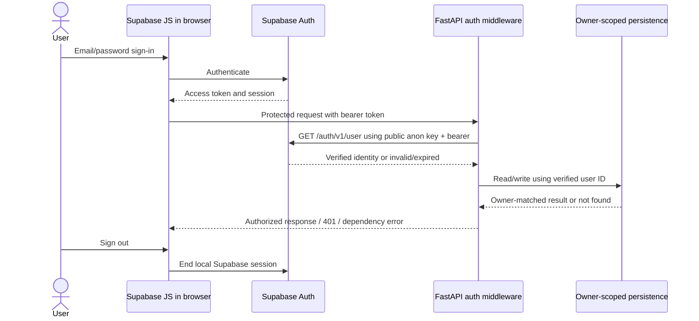
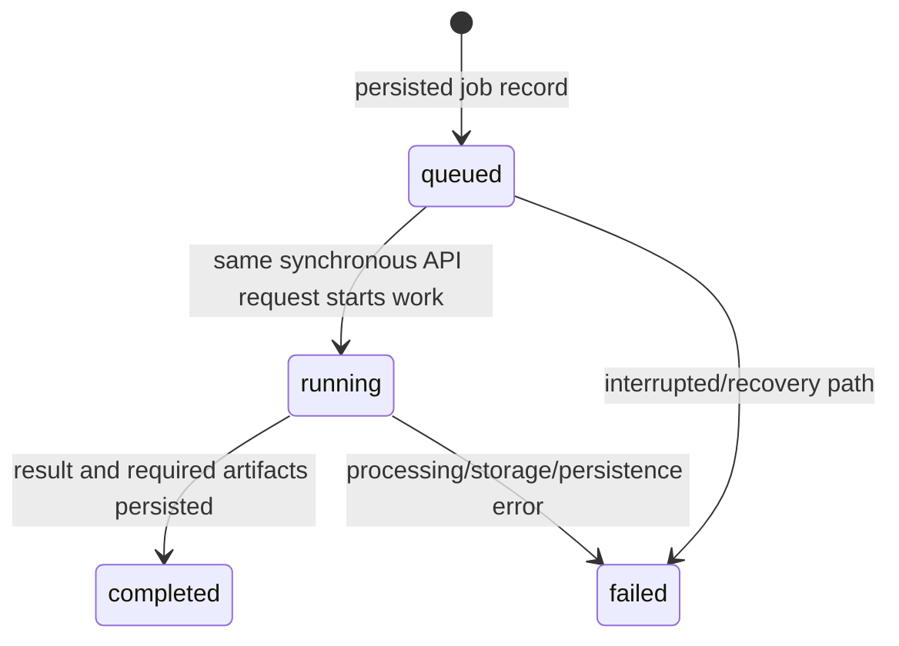

# Satellite Vision architecture and verification map

**As of:** 2026-10-10  
**Scope:** current repository implementation and the configured deployment values, not a proposed future architecture.

## Evidence statuses

| Status | Evidence-backed capabilities |
|---|---|
| Implemented and verified locally | GeoTIFF band discovery and input validation; NDVI, McFeeters NDWI, NDBI and the threshold land-cover baseline; aligned current/historical NDVI difference; synthetic 4x4 demo; API and UI regression tests; report/map output paths; local persistence and mocked Supabase Storage/auth behavior; bounded synchronous admission, pagination and resource checks. |
| Implemented but not fully verified | Supabase JWT validation and user-scoped API; PostgreSQL schema/migrations; private Storage metadata, uploads, downloads and signed links; durable artifact/job records; Render/Vercel integration. Code and mocks/local SQLite-backed tests exist, but live credentials and matching deployed versions were unavailable. |
| Planned or incomplete | Live satellite scene discovery/download; AOI clipping; reprojection/resampling; cloud masking; a trained and held-out-evaluated ML model; a durable asynchronous worker/queue; production-tested cloud persistence and the full authenticated journey. |

“Verified locally” refers to software tests or execution against local/mocked resources, not scientific validation or live-service verification. The current worktree does not include authoritative satellite scenes or labeled ground truth.

## System architecture



The diagram's Supabase links are conditional source-code paths. At verification time, the checked-in Render Blueprint named `https://team-s4-ten.vercel.app` as its CORS origin and the frontend production configuration targeted `https://satellite-vision-dashboard.onrender.com`; the live page loaded API resources from that same API origin. The Render Blueprint declares service name `satellite-vision-api`, but the Dashboard mapping could not be confirmed. The public Vercel and Render hosts responded, but the deployed builds/routes differed from this worktree. Production database, Auth, and Storage connectivity were not verified.

## Frontend-to-backend analysis request

```mermaid
sequenceDiagram
  actor User
  participant UI as React dashboard
  participant Auth as Supabase Auth (optional)
  participant API as FastAPI
  participant Files as Local GeoTIFF/filesystem
  participant Work as Synchronous analysis
  participant DB as PostgreSQL (optional)
  participant Bucket as Private Storage (optional)

  User->>UI: Select analysis / request demo
  opt Authentication is configured
    UI->>Auth: Sign in; receive access token
    UI->>API: Request with Authorization: Bearer token
    API->>Auth: GET /auth/v1/user
    Auth-->>API: Verified user identity
  end
  UI->>API: POST /api/analyze/{analysis_key} or /api/analyze/all
  API->>DB: Create scoped analysis/job, if configured
  API->>Files: Resolve selected data and source bands
  API->>Work: Validate, calculate, render and build summary
  Work->>Files: Write local intermediate/result artifacts
  opt Cloud artifact persistence configured
    Work->>Bucket: Upload private artifact objects
    Work->>DB: Persist artifact references and completed summary
  end
  API-->>UI: Summary, job ID and available artifact manifest
  UI->>API: Authenticated result/artifact GET
  API->>DB: Owner-scoped metadata lookup (if configured)
  API->>Bucket: Stream private object (if configured)
  API-->>UI: Result or artifact bytes
```

Local public-demo mode omits Supabase Auth, PostgreSQL, and cloud Storage. In that mode source uploads and local results are shared by callers who can reach the API; do not use private data. In authenticated/cloud mode, the backend derives the owner from the verified Auth response and scopes result/job/artifact retrieval to that owner.

## Raster analysis pipeline



The expected band pairings and implemented equations are:

| Product | Bands | Formula |
|---|---|---|
| NDVI | B08 NIR, B04 red | `(B08 - B04) / (B08 + B04)` |
| McFeeters NDWI | B03 green, B08 NIR | `(B03 - B08) / (B03 + B08)` |
| NDBI | B11 SWIR, B08 NIR | `(B11 - B08) / (B11 + B08)` |
| NDVI difference | aligned current and historical B04/B08 | `NDVI_current - NDVI_historical` |

No atmospheric correction, cloud masking, automatic reprojection or resampling is performed. Output values are not silently clipped to `[-1, 1]`; negative source samples can produce out-of-range values and quality warnings.

## Database, object storage and artifact retrieval



Alembic migrations `0001`-`0004` create/extend analysis, job, status-history and artifact metadata, owner/idempotency fields, and a history index. Large artifact binaries are stored as objects/files rather than PostgreSQL values. PostgreSQL stores references and JSON summaries. Authenticated success depends on required persistence completing; retries use scoped idempotency keys where PostgreSQL is present. No permanent public URL is the intended artifact access path. Source uploads in Render's local data directory are ephemeral unless a persistent disk is separately provisioned. Live PostgreSQL and Storage CRUD was not tested.

## Authentication and authorization



Auth is mandatory when `REQUIRE_AUTH=true` or backend database/Supabase settings activate persistence; protected access is enforced on the API. Health, readiness and auth-status are public; CORS preflight is permitted. Tests mock the Auth HTTP response and assert bearer forwarding and user isolation. The production Supabase Auth endpoint and sign-out behavior were not verified.

## Analysis job lifecycle and execution model



The API performs the analysis in the request process; `queued` is a short persisted transition, not work dispatched to a background queue. A configured process-local concurrency limit rejects excess work with HTTP 503. Startup recovery marks interrupted jobs failed when persistence is reachable. There is no durable worker, cross-instance scheduler, or user cancellation. Do not claim background execution or automatic restart/resume.

## Deployment and environment boundary

- Vercel: React/Vite static frontend. Public build settings: `VITE_API_URL`, `VITE_SUPABASE_URL`, `VITE_SUPABASE_ANON_KEY`.
- Render: FastAPI service from `render.yaml`; health check `/api/ready`; Python version configured there as `3.12.11`; Blueprint CORS origin is the exact Vercel site.
- The checked-in frontend production target is `https://satellite-vision-dashboard.onrender.com`, while the Render Blueprint declares service name `satellite-vision-api`. The Render Dashboard mapping was not accessible to confirm how this mismatch is resolved.
- Optional backend persistence/auth: `DATABASE_URL`, `SUPABASE_URL`, `SUPABASE_ANON_KEY`, `SUPABASE_SERVICE_ROLE_KEY`, `SUPABASE_STORAGE_BUCKET`, `REQUIRE_AUTH`.
- Backend Supabase endpoints must use HTTPS; plain HTTP is allowed only for localhost/loopback development to avoid forwarding bearer or service-role credentials over cleartext.
- Other backend controls: `DATA_DIR`, `OUTPUT_DIR`, `API_HOST`, `API_PORT`, `CORS_ORIGINS`, `SATELLITE_PROVIDER`, `COPERNICUS_CLIENT_ID`, `COPERNICUS_CLIENT_SECRET`, `SATELLITE_CACHE_DIR`, `SATELLITE_TIMEOUT`, `SATELLITE_MAX_CLOUD_COVER`, `MAX_UPLOAD_BYTES`, `MAX_RASTER_BYTES`, `MAX_RASTER_PIXELS`, `MAX_INPUT_ARRAY_BYTES`, `MAX_ANALYSIS_SECONDS`, `MAX_CONCURRENT_ANALYSES`, `MAX_ARTIFACT_BYTES`, `DATABASE_POOL_SIZE`, `DATABASE_MAX_OVERFLOW`.
- Never set database credentials or the Storage service-role key in frontend/Vite variables. Public anon configuration is not a service-role secret.

## API surface (representative current routes)

- **Status/configuration:** `GET /api/health`, `/api/ready`, `/api/auth/status`, `/api/persistence/status`, `/api/dataset`, `/api/metadata`, `/api/data-quality`, `/api/model/status`.
- **Uploads and source discovery:** `POST /api/dataset/{period}/upload`; `GET /api/satellite/status`, `/api/satellite/products`, `/api/satellite/products/{product_id}`, `/api/satellite/cache`; `POST /api/satellite/search`, `/api/satellite/download`; `DELETE /api/satellite/cache/{product_id}`. The live search/download path is not operational and responds as unimplemented; `mock` is synthetic.
- **Analysis:** `POST /api/analyze/{analysis_key}`, `/api/analyze/all`, `/api/geoai/spatial-analysis`, `/api/geoai/vegetation-forecast`, `/api/geoai/land-cover-transitions`.
- **Results:** `GET /api/results`, `/api/results/{result_id}`, `/api/analyses/{analysis_id}`, `/api/jobs/{job_id}`, `/api/results/{result_id}/artifacts`, registered artifact download and expiring signed-download endpoints.
- **Visualization and validation:** `GET /api/visualization/{kind}`, `/api/geoai/status`, `/api/geoai/demo`, `/api/geoai/history`, `/api/geoai/model-evaluation`, `/api/geoai/risk-indicators`.

Request/response details are implemented in `backend/api/routes.py`. The production service checked on 2026-10-10 returned HTTP 200 for `/api/health` and `/api/ready` after a longer retry; `/api/auth/status`, `/api/persistence/status`, and `/api/geoai/demo` returned 404. An analysis preflight requesting `Idempotency-Key` returned HTTP 400. Both credential-free and malformed-bearer-token `GET /api/results?limit=1` requests returned HTTP 200 with 29-byte responses; both bodies were discarded and not inspected. This demonstrates failure to reject those requests, not proof that data was exposed. Treat results access as a potential authorization exposure and do not submit private data. A harmless empty forecast POST previously returned HTTP 500 without CORS headers. Redeploy and repeat these checks before relying on the deployed API.

## Verification boundary

The latest final-audit local results were backend **95 passed / 0 failed**, frontend **28 passed / 0 failed**, and a successful Vite production build; isolated cloud interactions were mocked. The deterministic demo endpoint is covered by tests and returns `data_classification=synthetic`. These checks verify application code paths, not real-scene scientific validity or cloud services.

The configured Vercel page served the old `index-BEv36dup.js` bundle and exposed no visible sign-in control. The live API returned HTTP 200 for `/api/health` and `/api/ready` after retry, but 404 for current Auth, persistence-status, and synthetic-demo routes. Missing and malformed credentials each received HTTP 200 on the results list; the response bodies were not inspected. The CORS preflight for `Idempotency-Key` failed with HTTP 400. No valid cloud credentials or raster test input were available. Production Supabase PostgreSQL CRUD, valid Auth login/JWT validation, private Storage upload/download, cross-user denial, and complete authenticated analysis/artifact retrieval are blocked/unverified. The live deployment is not safe for private data and is not verified as demo-ready. The current source's isolated synthetic demo remains a local-only presentation option. See [README limitations and production verification](../../README.md#production-verification-status).
